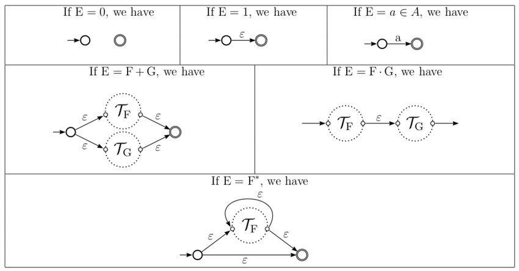
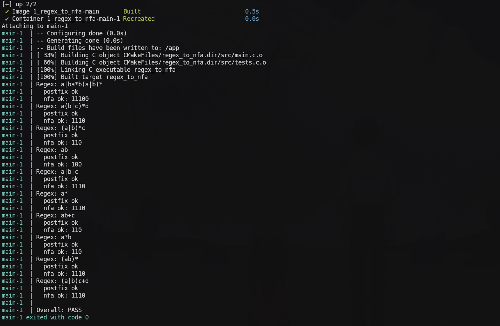

# Practice 1

Given a regular expression as input, the program must:

1. Parse the expression and convert it to postfix notation
2. Construct an NFA using Thompson's algorithm
3. Simulate the NFA to determine whether multiple input strings are accepted

## Technical report

A complete technical report of the implementation and design details is available at [report/report.pdf](./report/report.pdf).

The report is written in [Typst](https://typst.app/).

## Thompson's fragments



## Validating the program

Run the validator with

```bash
docker build -t regex_to_nfa_validator .
docker run --rm regex_to_nfa_validator
```

Or if you have docker compose installed, just run

```bash
docker compose up
```

All tests passes successfully:



## Running the program

```bash
# Parsing regex to postfix
docker compose run --rm main sh -c "cmake . && make && (echo 'a(b|c)*' | ./regex_to_nfa -r)"

# Creating NFA from regex and evaluating multiple inputs
docker compose run --rm main sh -c "cmake . && make && (printf '%s\n' "(ab)*" "ab" "aba" "abab" | ./regex_to_nfa -t)"
```

## Running the tests

```bash
docker compose run --rm main sh -c "cmake . && make && ./regex_to_nfa -x"
```

<!--
// TODO

(+1 pt) Inclusion de un an ́alisis de complejidad temporal y espacial de la
solución implementada, demostrando una comprensi ́on profunda de los algoritmos
utilizados.

(+3.5 pts) Implementaci ́on de una interfaz gr ́afica para visualizar el NFA resul-
tante.
-->
